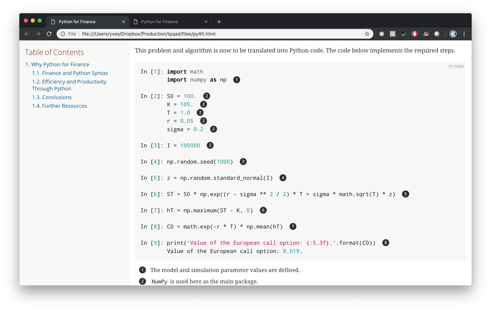

 

# tpqad

## Asciidoctor with a Twist

This repository provides a few (unpolished) helper scripts to write larger documents with Asciidoctor that import (Python) code from Jupyter Notebook semi-automatically.

The approach introduced hase been used e.g. to write the book Python for Finance (2nd ed., O'Reilly). See http://py4fi.tpq.io.

The repository is authored and maintained by The Python Quants GmbH. &copy; Dr. Yves J. Hilpisch. MIT License.

## Requirements

The following requires a standard Python 3.x installation as well as the installation of Asciidoctor &mdash; see https://asciidoctor.org.

## Basic Idea

The basic idea of the approach is to use Asciidoctor as the basis. Codes can be written and stored in Jupyter Notebooks. Tags are added that later (after a parsing step) are used to include code snippets automatically into the Asciidoctor files. The same holds true for images/plots that are created during the execution of a Jupyter Notebook.

## Sources

The files in the `files` folder are taken from earlier draft versions of **Python for Finance** (2nd ed., O'Reilly, http://py4fi.tpq.io). They have been modified for the simplified example to follow.

## Files and Steps

To render the example files (see `files` folder) with Asciidoctor, do the following.

**First**, execute the Jupyter Notebook (`code/why_python.ipynb`) and save it. Note the tags added in `raw` cells. Plots are saved automatically (in `images` folder).

**Second**, on the shell in the `files` folder, parse the executed and saved Jupyter Notebook via

    python nb_parse.py code/why_python.ipynb
    
This creates a text file with location and name `code/why_python.txt`.

**Third**, on the shell, execute

    asciidoctor -a stem=latexmath py4fi.asciidoc
    
to render a **HTML version**.

**Fourth**, on the shell, execute

    asciidoctor-pdf -r asciidoctor-mathematical -a pdf-style=basic-theme.yml py4fi.asciidoc
    rm *.png
    
to render a **PDF version** and delete temporary `png` files.

## `nb_parse.py`

The file `nb_parse.py` is at the core of the example and the approach presented. It has grown over the course of writing **Python for Finance** (2nd ed.). However, it has not been reenginered or optimized in any way. Therefore, use it with caution and take it maybe as a starting point for your custom conversions.

## Example Output

The following screenshot shows example output from the **HTML version**.

The following screenshot shows example output from the **PDF version**.

 

<a href="http://tpq.io" target="_blank">http://tpq.io</a> | <a href="http://twitter.com/dyjh" target="_blank">@dyjh</a> | <a href="mailto:training@tpq.io">training@tpq.io</a>
